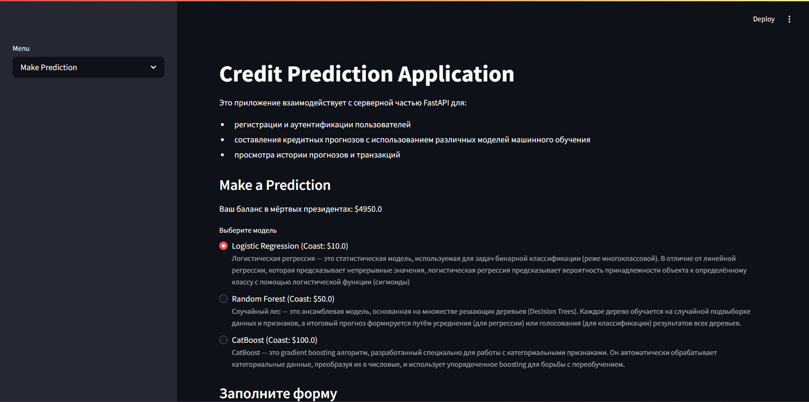
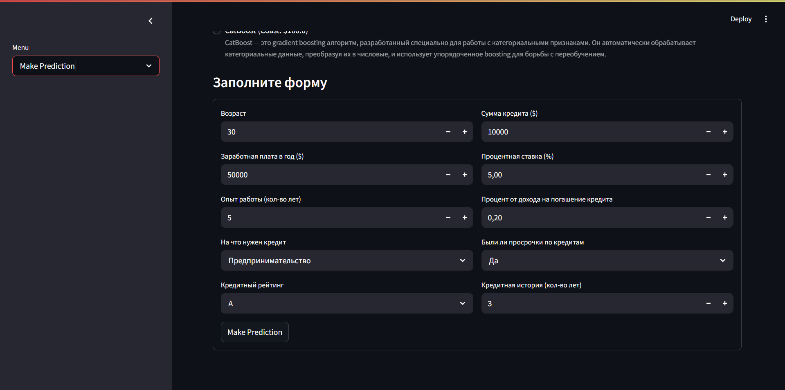
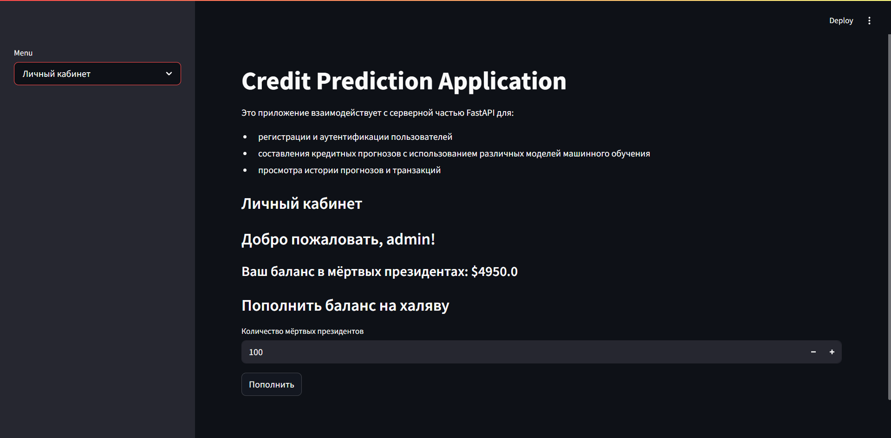
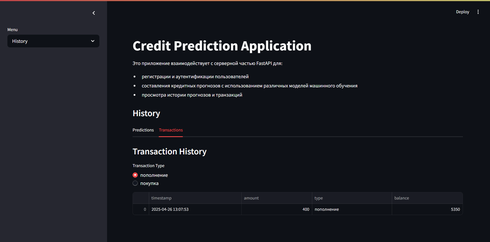
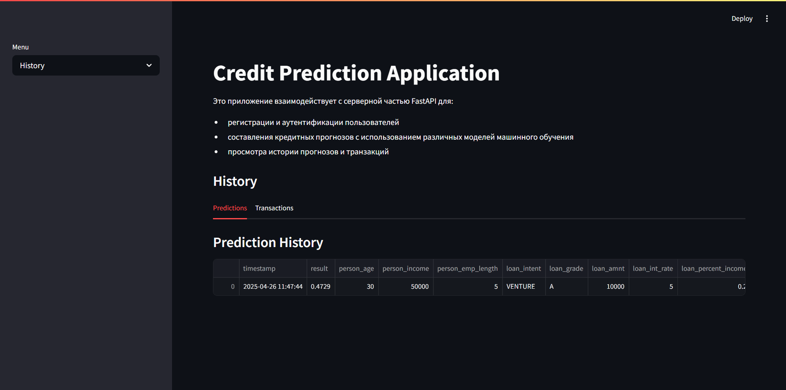
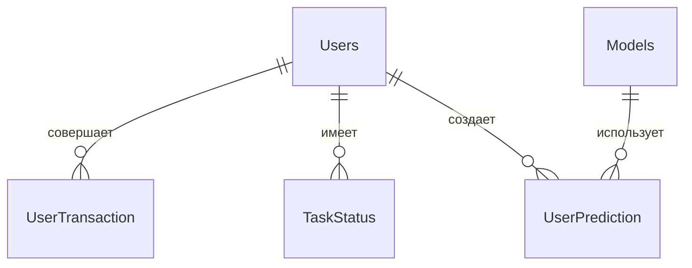

# Прогноз вероятности одобрения кредита

## Бизнес логика

###  1. Регистрация и аутентификация
1. Пользователь вначале попадает на начальную страницу


2. Пользователь регистрируется и вводит `username`, `password`, `email`. `username` должен быть уникальным


3. Пароль хранится в хешированном виде (`bcrypt`)

4. Пользователь авторизуется после регистрации
    - При успешном входе генерируется `JWT-токен` с ограниченным временем жизни а также появляются защищённые `роуты` меню для пользователя


|   |  | 
|:-------|:-------|
|  |   | 


### 2. Работа с прогнозами
1. Пользователь выбирает одну из модель:
    - `Logistic Regression`
    - `Random Forest`
    - `CatBoost`



2. Пользователь вводит данные: 
    * `person_age`: возраст кандидата.
    * `person_income`: сколько денег кандидат зарабатывает в год.
    * `person_emp_length`: сколько лет работает кандидат.
    * `loan_intent`: причина, по которой кандидату нужен кредит.
    * `loan_grade`: оценка, показывающая, насколько кандидат надежен в погашении кредитов.
    * `loan_amnt`: сумма денег, которую кандидат хочет занять.
    * `loan_int_rate`: процентная ставка, взимаемая по кредиту.
    * `loan_percent_income`: какой процент дохода кандидата пойдет на выплаты по кредиту.
    * `cb_person_default_on_file`: показывает, были ли просрочки по кредиту у кандидата.
    * `cb_person_cred_hist_length`: Как долго у кандидата была кредитная история 



3. Система проверяет достаточность средств на балансе
4. При успешной проверке:
    - Списывается стоимость прогноза
    - Создается транзакция
    - Задача отправляется в `Celery`
    - Создается запись в `UserPrediction`

5. Фоновая задача `monitor_task` периодически проверяет статус выполнения и обновляет результаты

### 3. Управление балансом
1. Пользователь может пополнять баланс



2. Каждое пополнение фиксируется в транзакциях



3. При использовании моделей баланс автоматически уменьшается

### 4. Получение статистики
1. Пользователь может просматривать:
    - Описание доступных моделей
    - Историю своих прогнозов
    - Историю транзакций (пополнений или расходов)




### 5. Базы данных

Используется база данных SQLite со следующими таблицами

---

#### 📌 **Содержание**  
1. [Users](#-users)  
2. [UserTransaction](#-usertransaction)  
3. [TaskStatus](#-taskstatus)  
4. [UserPrediction](#-userprediction)  
5. [Models](#-models)  

---

#### 👥 **Users**  
**Описание:** Хранит данные о пользователях системы.  

| Поле          | Тип         | Описание                          | Дополнительно               |
|---------------|-------------|-----------------------------------|-----------------------------|
| `id`          | `Integer`   | Уникальный идентификатор          | `PRIMARY KEY, AUTOINCREMENT`|
| `username`    | `String`    | Имя пользователя                  |                             |
| `email`       | `String`    | Электронная почта                 |                             |
| `password`    | `String`    | Пароль (хешированный)             |                             |
| `authtime`    | `DateTime`  | Время последней авторизации       |                             |
| `balance`     | `Float`     | Текущий баланс                    | `DEFAULT=5000`              |

---

#### 💰 **UserTransaction**  
**Описание:** Логирует финансовые транзакции пользователей.  

| Поле          | Тип         | Описание                          | Связи                  |
|---------------|-------------|-----------------------------------|------------------------|
| `id`          | `Integer`   | Уникальный ID транзакции          | `PRIMARY KEY`          |
| `user_id`     | `Integer`   | ID пользователя                   | `→ Users.id`           |
| `task_id`     | `String`    | ID задачи                         |                        |
| `timestamp`   | `DateTime`  | Время транзакции                  |                        |
| `amount`      | `Float`     | Сумма транзакции                  |                        |
| `type`        | `String`    | Тип (`пополнение`/`покупка`)      |                        |
| `balance`     | `Float`     | Баланс после транзакции           |                        |

---

#### ✅ **TaskStatus**  
**Описание:** Отслеживает статусы задач пользователей.  

| Поле          | Тип         | Описание                          |  
|---------------|-------------|-----------------------------------|  
| `id`          | `Integer`   | Уникальный ID записи              |  
| `user_id`     | `Integer`   | ID пользователя                   |  
| `task_id`     | `String`    | ID задачи                         |  

---

#### 🔮 **UserPrediction**  
**Описание:** Содержит прогнозы пользователей и связанные метрики.  

| Поле                          | Тип         | Описание                                                                 |  
|-------------------------------|-------------|--------------------------------------------------------------------------|  
| `id`                          | `Integer`   | Уникальный ID прогноза                                                  |  
| `user_id`                     | `Integer`   | ID пользователя (`→ Users.id`)                                           |  
| `task_id`                     | `String`    | ID задачи                                                                |  
| `status`                      | `Boolean`   | Статус выполнения (`True`/`False`)                                       |  
| `timestamp`                   | `DateTime`  | Время создания/выполнения прогноза                                       |  
| `model_id`                    | `Integer`   | ID модели (`→ Models.id`)                                                |  
| `result`                      | `Float`     | Результат прогноза                                                       |  
| **Данные кандидата:**         |             |                                                                          |  
| `person_age`                  | `Integer`   | Возраст                                                                  |  
| `person_income`               | `Integer`   | Годовой доход ($)                                                        |  
| `person_emp_length`           | `Float`     | Опыт работы (годы)                                                       |  
| `loan_intent`                 | `String`    | Цель кредита                                                             |  
| `loan_grade`                  | `String`    | Кредитный рейтинг (A-F)                                                  |  
| `loan_amnt`                   | `Integer`   | Сумма кредита ($)                                                        |  
| `loan_int_rate`               | `Float`     | Процентная ставка (%)                                                    |  
| `loan_percent_income`         | `Float`     | % дохода на выплаты                                                      |  
| `cb_person_default_on_file`   | `String`    | Были ли дефолты (`Y`/`N`)                                                |  
| `cb_person_cred_hist_length`  | `Integer`   | Длина кредитной истории (годы)                                           |  

---

#### 🤖 **Models**  
**Описание:** Список доступных ML-моделей для прогнозирования.  

| Поле           | Тип        | Описание                          |  
|----------------|------------|-----------------------------------|  
| `id`           | `Integer`  | Уникальный ID модели              |  
| `name`         | `String`   | Название модели                   |  
| `cost`         | `Float`    | Стоимость использования ($)       |  
| `description`  | `String`   | Описание модели                   |  

---

#### 🔗 **Связи между таблицами**  



## Quick Start

1. Клонируем репозиторий
```cmd
git clone https://github.com/YarickVodila/billing_system.git
```

2. Создаём файл `.env`
    > Пример файла уже заполненного файла есть в корне проекта (`.env_example`). Необходимо только заменить `SECRET_KEY` на ваше слово, которое будет использоваться для шифрования `JWT` токена


3. Запускаем приложения с помощью `Docker-Compose`:

    - `build`
        ```cmd
        docker-compose up -d --build
        ```
    - `run`
        ```cmd
        docker-compose up -d
        ```
    - `stop`
        ```cmd
        docker-compose down
        ```

4. Endpoint сервиса
    - `API` - http://127.0.0.1:8000/docs#
    - `StreamLit` - http://127.0.0.1:8001