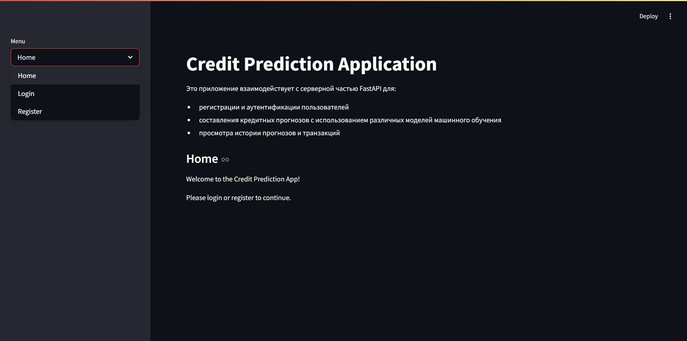

# Прогноз вероятности одобрения кредита

## Бизнес логика

###  1. Регистрация и аутентификация
1. Пользователь вначале попадает на начальную страницу



2. Пользователь регистрируется и вводит `username`, `password`, `email`. `username` должен быть уникальным


3. Пароль хранится в хешированном виде (`bcrypt`)

4. Пользователь авторизуется после регистрации
    - При успешном входе генерируется `JWT-токен` с ограниченным временем жизни а также появляются защищённые `роуты` меню для пользователя


|   |  | 
|:-------|:-------|
|  |   | 


### 2. Работа с прогнозами
1. Пользователь выбирает одну из модель:
    - `Logistic Regression`
    - `Random Forest`
    - `CatBoost`
2. Пользователь вводит данные: 
    * `person_age`: возраст кандидата.
    * `person_income`: сколько денег кандидат зарабатывает в год.
    * `person_home_ownership`: владеет ли заявитель домом или нет.
    * `person_emp_length`: сколько лет работает кандидат.
    * `loan_intent`: причина, по которой кандидату нужен кредит.
    * `loan_grade`: оценка, показывающая, насколько кандидат надежен в погашении кредитов.
    * `loan_amnt`: сумма денег, которую кандидат хочет занять.
    * `loan_int_rate`: процентная ставка, взимаемая по кредиту.
    * `loan_percent_income`: какой процент дохода кандидата пойдет на выплаты по кредиту.
    * `cb_person_default_on_file`: показывает, были ли просрочки по кредиту у кандидата.
    * `cb_person_cred_hist_length`: Как долго у кандидата была кредитная история 

3. Система проверяет достаточность средств на балансе
4. При успешной проверке:
    - Списывается стоимость прогноза
    - Создается транзакция
    - Задача отправляется в `Celery`
    - Создается запись в `UserPrediction`

5. Фоновая задача `monitor_task` периодически проверяет статус выполнения и обновляет результаты

### 3. Управление балансом
1. Пользователь может пополнять баланс

2. Каждое пополнение фиксируется в транзакциях

3. При использовании моделей баланс автоматически уменьшается

### 4. Получение статистики
1. Пользователь может просматривать:
    - Описание доступных моделей
    - Историю своих прогнозов
    - Историю транзакций (пополнений или расходов)

## Quick Start

1. Клонируем репозиторий
```cmd
git clone https://github.com/YarickVodila/billing_system.git
```

2. Запускаем приложения с помощью `Docker-Compose`:

    - `build`
        ```cmd
        docker-compose up -d --build
        ```
    - `run`
        ```cmd
        docker-compose up -d
        ```
    - `stop`
        ```cmd
        docker-compose down
        ```

3. Endpoint сервиса
    - `API` - http://127.0.0.1:8000/docs#
    - `StreamLit` - http://127.0.0.1:8001